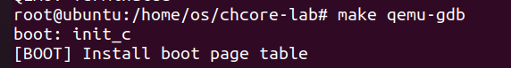
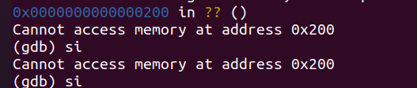
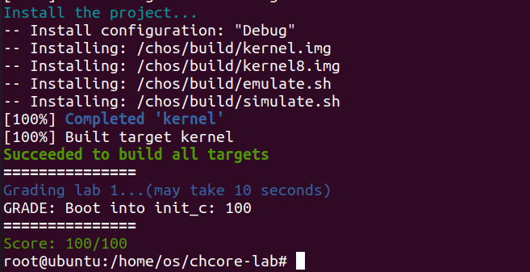

# lab1
517021910011
董云鹏
### 1.阅读 `_start` 函数的开头，尝试说明 ChCore 是如何让其中一个核首先进入初始化流程，并让其他核暂停执行的。

&#x20;      mpidr\_el1是一个ARM64处理器的系统寄存器，用于读取处理器的ID信息。mrs x8, mpidr\_el1指令将mpidr\_el1寄存器的值也就是当前处理器的ID读入寄存器x8中。如果x8的值为0，确定是主处理器，跳转到primary，否则继续往下执行到b .，所有secondary processors都停在这里等候。

&#x20;  主处理器跳转到primary后，进入初始化流程，调用函数arm64\_elX\_to\_el1，将当前处理器的执行级别从EL3或EL2切换到EL1。然后将boot\_cpu\_stack的地址加载到寄存器x0中。将INIT\_STACK\_SIZE加到x0的值中，用于确定栈顶的位置。将x0的值赋给sp寄存器，用于设置堆栈指针。

### 2.在 `arm64_elX_to_el1` 函数的 `LAB 1 TODO 1` 处填写一行汇编代码，获取 CPU 当前异常级别。

mrs x9,CURRENTEL

实现过程：将EL寄存器的值加载到通用寄存器X9，这样就获取了CPU的异常级别

### 3.在 `arm64_elX_to_el1` 函数的 `LAB 1 TODO 2` 处填写大约 4 行汇编代码，设置从 EL3 跳转到 EL1 所需的 `elr_el3` 和 `spsr_el3` 寄存器值。具体地，我们需要在跳转到 EL1 时暂时屏蔽所有中断、并使用内核栈（`sp_el1` 寄存器指定的栈指针）。

```python
  adr x9, .Ltarget
  msr elr_el3, x9
  mov x9, SPSR_ELX_DAIF | SPSR_ELX_EL1H
  msr spsr_el3, x9
```

1.  .Ltarget是一个标签，代表的是ret指令的地址，这里将它加载到x9寄存器中
2.  x9寄存器的值是ret地址，将其放入到elr\_el3,这就是异常返回后执行的指令地址。
3.  SPSR\_ELX\_DAIF是四个标志位，**DAIF都设置为1的情况下可以屏蔽所有中断**，SPSR\_ELX\_EL1H保存从EL3跳转到EL1时EL1状态的相关信息，将当前模式切换回EL1后用于恢复EL1的处理器状态，这里进行按位或操作，将两个值合并到x9中。
4.  最后将x9写入到spsr\_els寄存器中，设置跳转后的处理器状态

总之，SPSR\_ELX\_DAIF用来设置屏蔽中断，而 SPSR\_ELX\_EL1H用来设置内核栈。


### 4.结合此前 ICS 课的知识，并参考 `kernel.img` 的反汇编（通过 `aarch64-linux-gnu-objdump -S` 可获得），说明为什么要在进入 C 函数之前设置启动栈。如果不设置，会发生什么？

-   在进入C函数之前需要在栈上保存返回地址，如果没有保存返回地址则执行完成后不能返回到原位置。
-   进行pc,pstate等的状态保存，可以将寄存器压栈来保存状态，如果不进行压栈保存，寄存器信息会被破坏。
-   保存C函数中定义的临时变量，非静态局部变量一般保存在栈上，如果不设置启动栈，会导致函数执行异常。

### 5.在实验 1 中，其实不调用 `clear_bss` 也不影响内核的执行，请思考不清理 `.bss` 段在之后的何种情况下会导致内核无法工作。

.bss段是的作用是存放未初始化的全局变量和静态变量，程序在运行前需要调用clear\_bss清零。如果不清理.bss段，这些变量的初始值因为受到上一段程序的改动影响，可能是随机的，而不是期望的0值，这可能会导致程序出现Segmentation fault等错误，引发内核异常。

### 6.在 `kernel/arch/aarch64/boot/raspi3/peripherals/uart.c` 中 `LAB 1 TODO 3` 处实现通过 UART 输出字符串的逻辑。

```python
void uart_send_string(char *str)
{
    early_uart_init();//初始化串口
    while (*str) {//每次发送时，先将字符转换
        early_uart_send((unsigned int)*str++);
    }
}
```



有了输出

### 7.在 `kernel/arch/aarch64/boot/raspi3/init/tools.S` 中 `LAB 1 TODO 4` 处填写一行汇编代码，以启用 MMU。

```python
orr x8, x8, #SCTLR_EL1_M
```

寄存器 SCTLR\_EL1 中有设置位 SCTLR\_EL1\_M。这个位用于启用 MMU，它控制着页表的开关，将 MMU 打开后，系统将根据页表中的映射关系将虚拟地址转换为物理地址



成绩：


